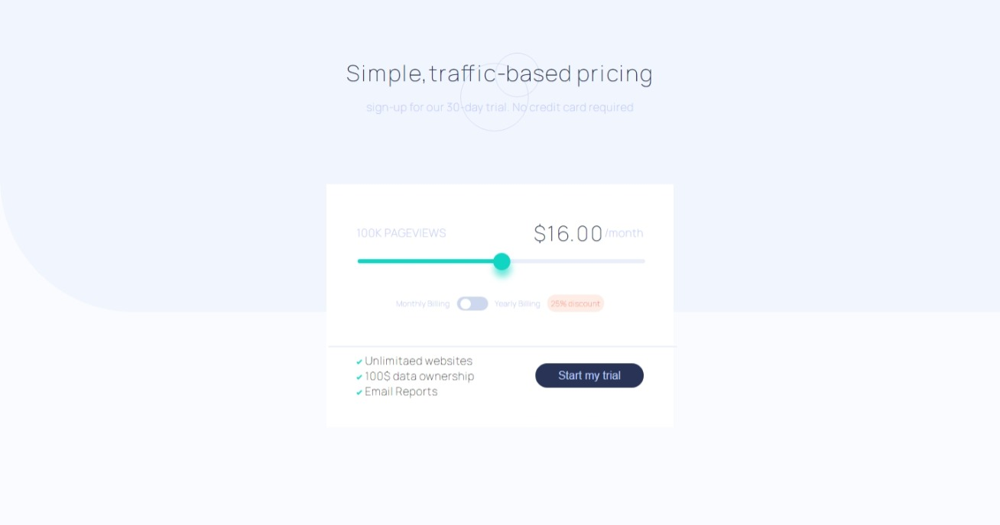

# Frontend Mentor - Interactive pricing component solution

This is a solution to the [Interactive pricing component challenge on Frontend Mentor](https://www.frontendmentor.io/challenges/interactive-pricing-component-t0m8PIyY8). Frontend Mentor challenges help you improve your coding skills by building realistic projects. 

## Table of contents

- [Overview](#overview)
  - [The challenge](#the-challenge)
  - [Screenshot](#screenshot)
  - [Links](#links)
- [My process](#my-process)
  - [Built with](#built-with)
  - [What I learned](#what-i-learned)
  - [Continued development](#continued-development)
  - [Useful resources](#useful-resources)
- [Author](#author)
- [Acknowledgments](#acknowledgments)

## Overview

### The challenge

Users should be able to:

- View the optimal layout for the app depending on their device's screen size
- See hover states for all interactive elements on the page
- Use the slider and toggle to see prices for different page view numbers

### Screenshot
### computer screen

### mobile screen

### Links

- Solution URL: [solution](https://www.frontendmentor.io/solutions/htmlcssjsdom-fr5CS1wS4)
- Live Site URL: [live site](https://gigagiorgadze.github.io/interactive-pricing-component-main/)

## My process

### Built with

- Semantic HTML5 markup
- CSS custom properties
- Flexbox

## Author

- Website - [Giga giorgadze](https://gigagiorgadze.github.io/personal-portfolio/m)
- Frontend Mentor - [@GigaGiorgadze](https://www.frontendmentor.io/profile/GigaGiorgadzegiorgadze_11
- Twitter - [@giorgadze_11](https://www.twitter.com/yourusername)

